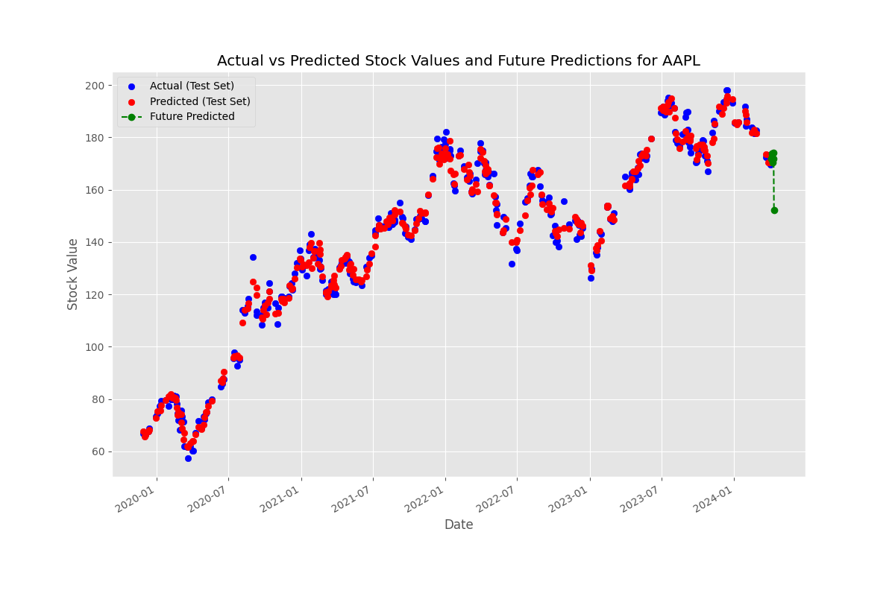
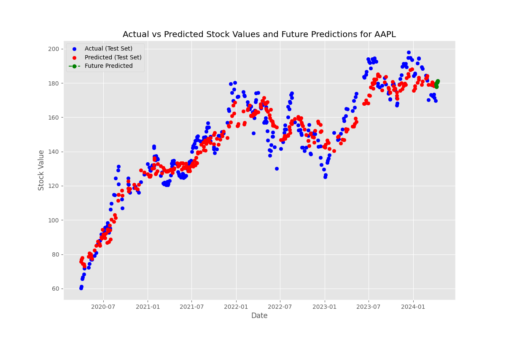
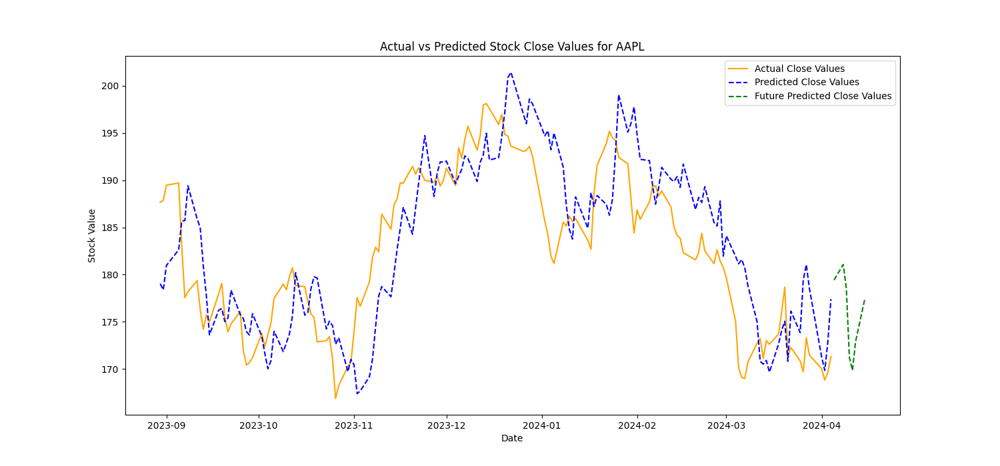
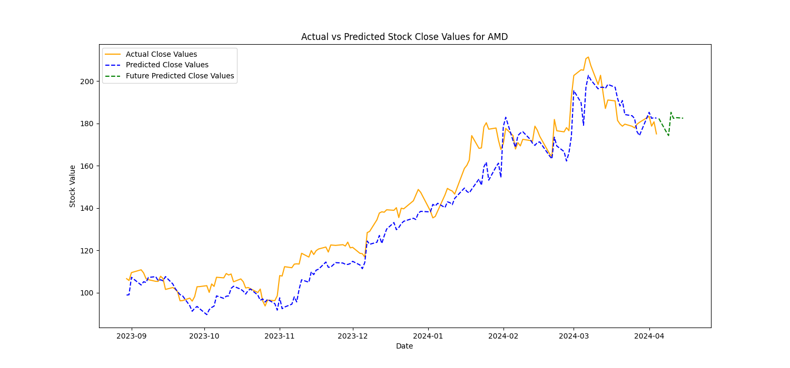
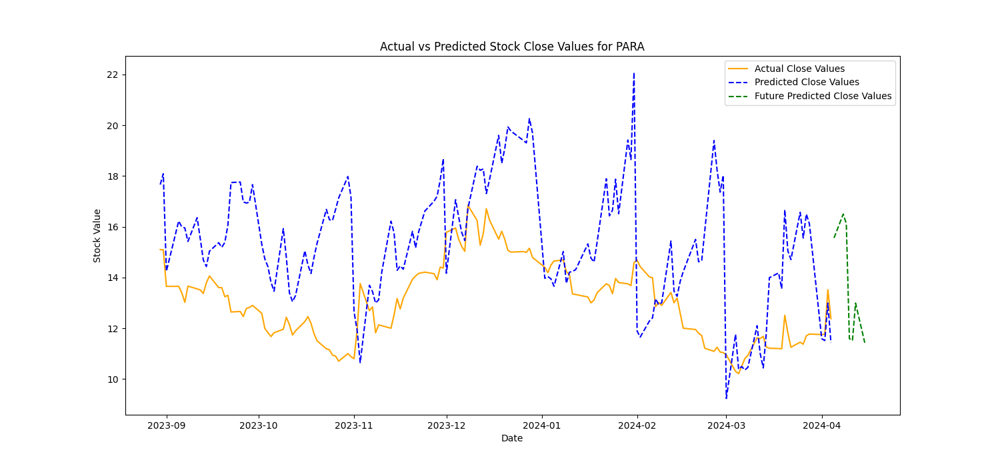
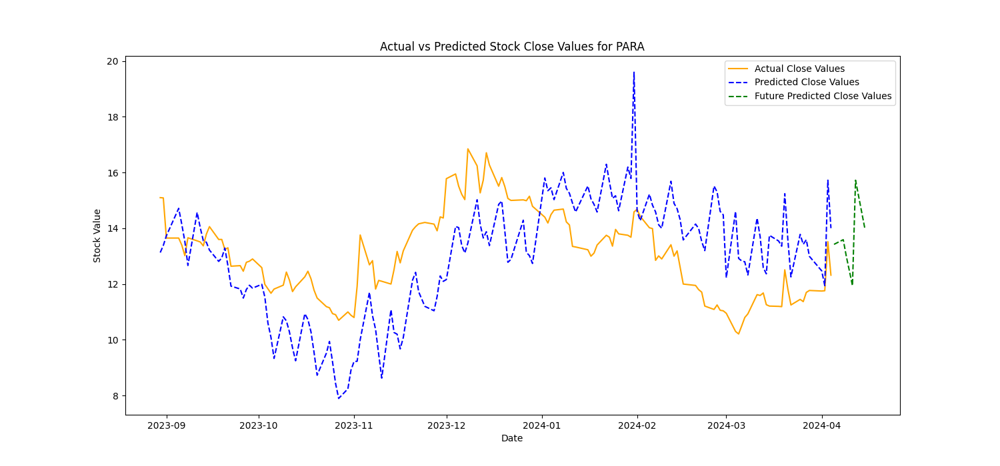
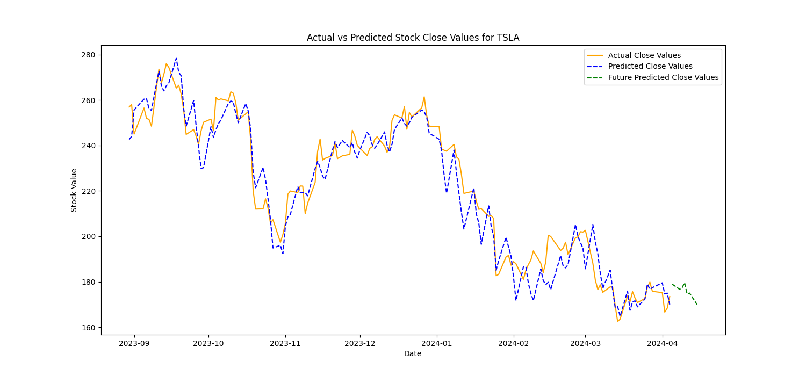

# About this Project

This project showcases 3 different machine learning models, each unique, with the main goal to show the working under the hood of a neural network.

All of our programs include gathering training data using yfinance api to pull *x* years of data to train on, for the parameter of years of data to gather, you will get some strange errors if you give a number of years more than the api has access to. 3 years is a safe parameter I used for training.

## XGBoostPred.py

This program implements an algorithm called XGBoost for stock price prediction, it is a algorithm within machine learning that does NOT use backpropagation

## DNNPred.py

This program implements a Dense Neural Network VIA TensorFlow libraries, it uses backpropagation, and it is what we model our third code after.

## NNPred.py

This program creates a neural network by hand, implementing various features to achieve a better price prediction. it uses backpropagation.

# Getting Started

Here we will discuss how to get our codes up and running


## First, make sure you have python, this was developed on Python 3.10.12

# Install prerequisites

### XGBoostPred.py

run ``` pip install matplotlib numpy optuna pandas yfinance pandas_datareader prophet scikit-learn statsmodels xgboost pmdarim ```
I had to remove pmdarim in the main pip line, and put it on its own line, that may be a necesity to run.
## DNNPred.py

run ``` pip install matplotlib numpy pandas yfinance scikit-learn tensorflow ```

## ManualNNPred.py
run ``` pip install matplotlib numpy pandas yfinance scikit-learn tensorflow ```

# Run the program

Simply get to the directory VIA terminal, run 'python *filename*

Running this code will give you predictions at the command line but also save a file to your current directory for the chart

For XGBoostPred.py and DNNPred.py, input 1 is Stock ticker, input 2 is number of days to predict, input 3 is years of data to gather

For ManualNNPred.py, input 1 is Stock ticker, input 2 is years of data to gathe,r input 3 is number of days to predict

There is no script to run multiple iterations, as each iteration takes a good bit of time for training and such.

# Example outputs
## XGBoost

Testing versus trained works great, predicting future seems to suffer a bit.



## DNN


# ManualNN


Chart format and output varies slightly, ManualNN works for most stocks, falters with some random specific stocks I tried from belgium and such, i assume that is an error with currency conversions as they would still follow the trend of actual, just at a different degree.

# Showcasing ManualNNPred.py with different inputs
## AAPL stock prediction (3 years of data, 7 days to predict)


### Notes

Works well!

## AMD stock prediction (3 years of data, 7 days to predict)


### Notes

Works well!

## PARA stock prediction (3 years of data, 7 days to predict)


### Notes

Doesn't work well, after adjusting various variables, I came to a realization that it was due to my logic in the training loop where we aim to stabalize the logic by having learning rate adjusted based on results, This caused an accuracy issue as the neural network got caught on the wrong logic. This is an ongoing struggle that modern models run into. To iterate this point, I commented out the lines that adjusted the learning rate and we get this graph, which is not perfect, but much better.
## PARA stock prediction no learning rate adjustment (3 years of data, 7 days to predict)



## TSLA stock prediction (3 years of data, 7 days to predict)


### Notes

Works well!


# Conclusion

Our neural network is not perfect, It is a single input layer, single hidden layer, single output layer. It is as minimal of a neural network as can be, although even with its light weight nature, we can see the potential and power. There is niche cases where it interprets data incorrectly, deviating from expected. Although we can see for most cases it works, looking into the code, we employ various strategies such as gradient clipping, trying different loss functions, optimizing lambda, and more to attempt to better our network. The 'random' nature of stock prices make a perfect prediction impossible, especially without context of real work data of things causing price plumets and rises. This is why no model, even the XGBoost model which was designed for this, was not perfect (especially in predicting future). It is also important to note that in our neural network, changing variables such as learning rate, lambda, gradient clipping limit, etc... heavily changes output. The values as is provide a best 'general case', although runs exist where say lambda = .01 performed better than lambda = 10.


Report: [Report](./Report/JR_Backpropagation_report.pdf)
